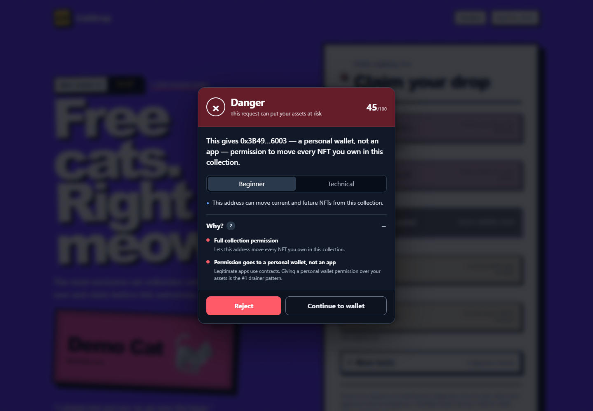
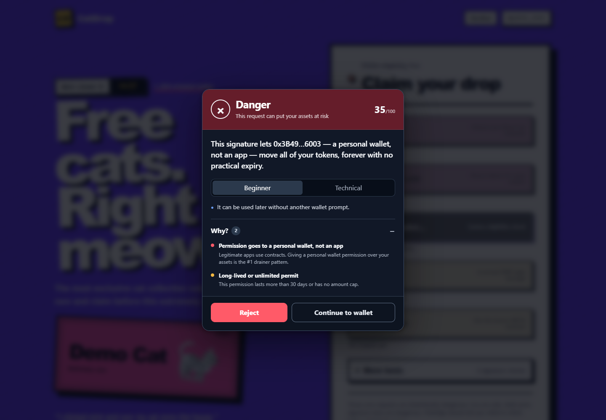
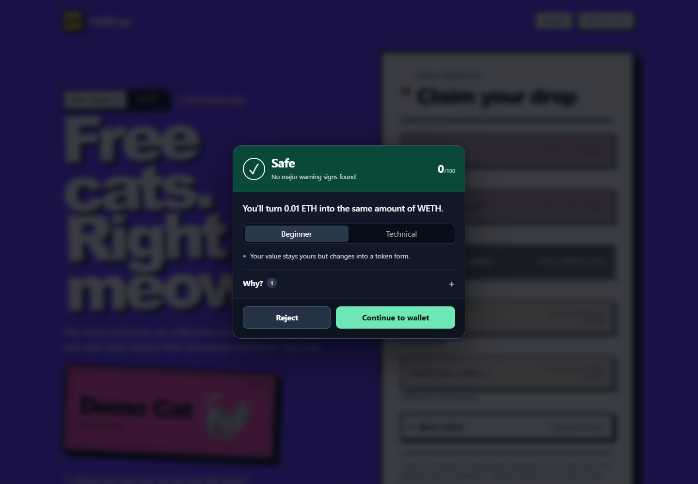
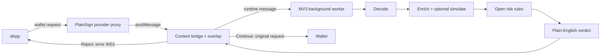

# PlainSign

**Understand a wallet request before you sign it.**

[Live Sepolia demo](https://adib-cyber007.github.io/plainsign/) · [Download PlainSign 0.1.0](https://github.com/adib-cyber007/plainsign/releases/latest/download/plainsign-0.1.0.zip) · [Architecture](docs/architecture.md)

## The 60-second pitch

A page can label a button “Free Mint” while asking your wallet for permission to move every NFT you own. Gasless signatures such as Permit2 can be just as powerful, but often look even less familiar.

PlainSign is a Chrome extension that pauses supported Ethereum transaction and signature requests before the wallet popup. It decodes the request, checks the addresses involved, applies deterministic rules from an open JSON file, and shows a plain-English verdict: **Safe**, **Caution**, or **Danger**. Reject returns the standard wallet error, while Continue sends the original request to the wallet unchanged.

There is no backend, paid service, account, or telemetry. Optional Alchemy simulation can add expected balance changes; the rest works with public Sepolia RPC and Blockscout.

## See it catch the trick

| “Free Mint” is a full NFT permission | Permit2 grants a long-lived token permission | Wrapping ETH uses known WETH |
|---|---|---|
|  |  |  |

## Try it in 5 minutes

Use a test wallet only. The public demo uses the Sepolia test network and valueless test assets.

1. Download [plainsign-0.1.0.zip](https://github.com/adib-cyber007/plainsign/releases/latest/download/plainsign-0.1.0.zip) from the latest GitHub Release.
2. Extract the ZIP to a folder you can keep. In Chrome, open `chrome://extensions`.
3. Turn on **Developer mode**, click **Load unpacked**, select the extracted folder, and confirm the PlainSign card has no red **Errors** button.
4. Install or unlock MetaMask in a throwaway Chrome profile. Enable test networks and select **Sepolia**.
5. Open the [CatDrop demo](https://adib-cyber007.github.io/plainsign/), click **Connect wallet**, and choose the throwaway account.
6. Click **Free Mint**. PlainSign should show a red **Danger** card before MetaMask opens. Click **Reject**; the page should report `Rejected (4001)`.
7. Try **Sign in** for a green login explanation and **Wrap 0.01 ETH** for the known-WETH path. Continuing Wrap requires at least 0.01 Sepolia ETH plus gas.

If the extension was already open when you installed or reloaded PlainSign, refresh the demo tab before testing.

## Architecture



See [docs/architecture.md](docs/architecture.md) for execution contexts, trust boundaries, and the complete request lifecycle.

## What we intercept and why signatures matter

PlainSign intercepts five EIP-1193 methods:

| Method | Why inspect it |
|---|---|
| `eth_sendTransaction` | Calldata can hide token approvals, NFT collection permissions, transfers, swaps, and contract calls. |
| `eth_signTypedData_v4` / `v3` | EIP-712 signatures can create permits or marketplace orders that someone relays later without another wallet prompt. |
| `personal_sign` | Usually a readable login message, but an opaque 32-byte hash deserves a strong warning. |
| `eth_sign` | Raw hash signing is unusually powerful and receives an immediate Danger verdict. |

All other provider methods pass through immediately. Continue forwards the original request object; PlainSign never rewrites it.

## How the verdict is decided

The engine evaluates [`src/risk/rules.json`](src/risk/rules.json), sums matching weights, applies explicit verdict floors or instant verdicts, and lists every triggered reason. The table below is generated from that file by `npm run docs:rules`.

<!-- RULES_TABLE_START -->
Thresholds: **Safe 0-24**, **Caution 25-59**, **Danger 60-100**. Any critical reason is at least Caution.

| Rule | Plain-English reason | Severity | Score effect |
|---|---|---:|---:|
| `eth_sign` | Raw hash signing (eth_sign) | critical | Instant danger |
| `personal_sign_hash` | Signing an opaque 32-byte hash | critical | Instant danger |
| `spender_is_eoa` | Permission goes to a personal wallet, not an app | critical | Instant danger |
| `unlimited_approval` | Unlimited token permission | critical | +50 |
| `approval_for_all` | Full collection permission | critical | +45 |
| `permit_long_or_unlimited` | Long-lived or unlimited permit | warn | +35 |
| `permit2_transfer` | Gasless token transfer signature | critical | +40 |
| `order_near_zero` | Listing your NFTs for ~0 | critical | Instant danger |
| `contract_new` | Contract is less than 7 days old | warn | +25 |
| `unverified` | Unverified contract source | info | +15 |
| `domain_mismatch` | Website doesn't match the protocol | warn | +25 |
| `net_outflow` | You lose assets and receive nothing | critical | +40 |
| `sim_reverted` | Transaction would fail | info | 0; at least caution |
| `unknown_function` | Unrecognized action | warn | +20; at least caution |
| `allowlisted_target` | Known protocol on its official site | info | -20 |
<!-- RULES_TABLE_END -->

Rules are heuristics, not guarantees. A green verdict means the decoded request matched known low-risk patterns, not that an application or contract is universally safe.

## Develop and test

Requirements: Node.js 20 or 22, npm, and Chrome or Chromium.

```powershell
npm ci
npm --prefix contracts ci
npm --prefix demo-dapp ci
npm run verify:all
```

Useful artifact commands:

```powershell
npm run docs:rules
npm run screenshots
npm run slides
npm run package
```

`npm run verify:all` runs ESLint, TypeScript, unit tests, the production build, and browser E2E tests. `npm run demo:local` starts a no-faucet Hardhat demo. Environment variables and optional simulation setup are documented in [`.env.example`](.env.example).

## Limitations

- Verdicts are transparent heuristics, not security guarantees.
- Chrome with MetaMask is the primary tested path. EIP-6963 wallet discovery is best-effort.
- Transaction simulation is optional and Sepolia-only. Signatures are decoded, not simulated.
- Unknown functions and typed data default to Caution because PlainSign cannot prove their meaning.
- Demo contracts live on Sepolia and hold only test assets.
- The extension is distributed as an unpacked hackathon build, not through the Chrome Web Store.

## Roadmap

- Offer a revoke action for dangerous token and NFT permissions.
- Consume community-maintained drainer lists with auditable provenance.
- Add more chains while preserving the same open-rule and no-backend design.

## Team

Built by **[TEAM NAME]** for a hackathon. Replace this placeholder with the final team name and participant names before submission.

## License

[MIT](LICENSE)
