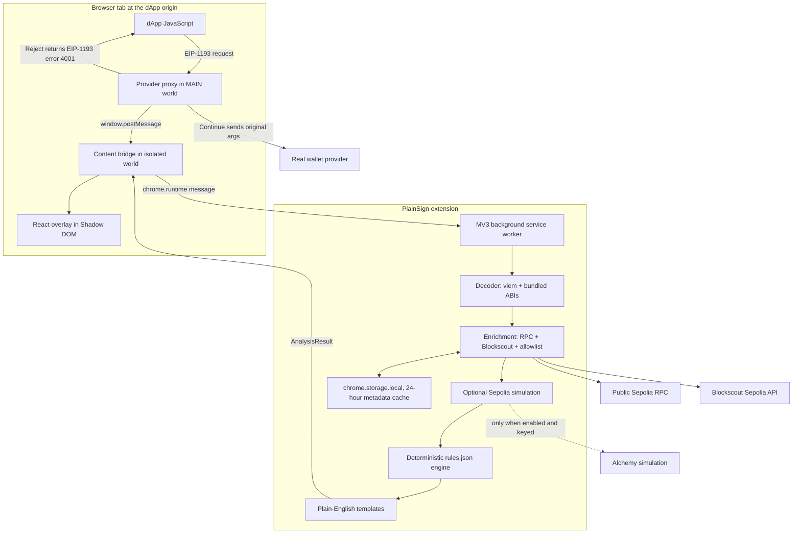
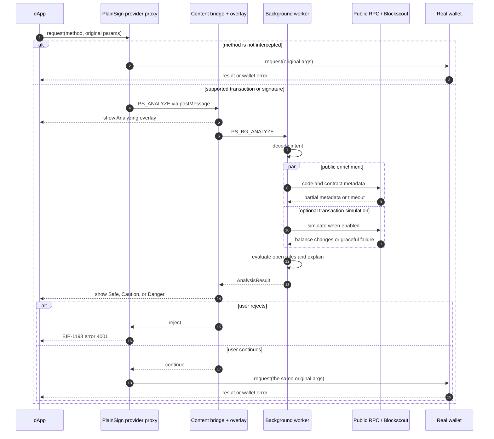

# PlainSign architecture

PlainSign runs entirely inside a Chrome Manifest V3 extension. It has no backend, account system, analytics, or telemetry. The extension reads only supported wallet requests and public chain metadata needed for the verdict.

## Components and trust boundaries

The MAIN-world proxy can see the provider that a dApp uses, but it has no `chrome.*` access. The isolated content script is the bridge and owns the overlay. The background service worker performs analysis so page code cannot call internal modules directly.

## Request lifecycle

## Analysis stages

| Stage | Input | Output | Failure behavior |
|---|---|---|---|
| Decode | Original EIP-1193 method and parameters | Intent such as NFT permission, Permit2 signature, SIWE, or unknown | Returns an unknown intent; never throws to the page |
| Enrich | Relevant addresses, chain, and page origin | Contract/EOA status, verification, age, known protocol/domain | Keeps partial results and uses cached values when available |
| Simulate | Sepolia transaction and optional Alchemy key | Expected asset changes or revert status | Returns unavailable; analysis continues |
| Risk | Intent, metadata, and simulation | Score, verdict, triggered reasons | Pure deterministic evaluation of `rules.json` |
| Explain | Intent and risk result | Beginner and technical wording | Local templates only |

## Security properties

- The proxy forwards unsupported methods without opening the overlay.
- Continue forwards the original request unchanged.
- Reject uses the standard user-rejection code `4001` so dApps handle it normally.
- Bridge serialization preserves `bigint` values without evaluating page-controlled code.
- Strict CSP pages do not need injected inline scripts.
- Analysis degrades to Caution when the background worker or enrichment cannot complete safely.
- Address metadata is cached locally for 24 hours; PlainSign sends no telemetry.

## Known boundaries

PlainSign provides a warning layer, not a proof of contract safety. Chrome and MetaMask are the primary demo environment. EIP-6963 wrapping is best-effort, signature requests are decoder-based rather than simulated, and the demo contracts use Sepolia test assets.
