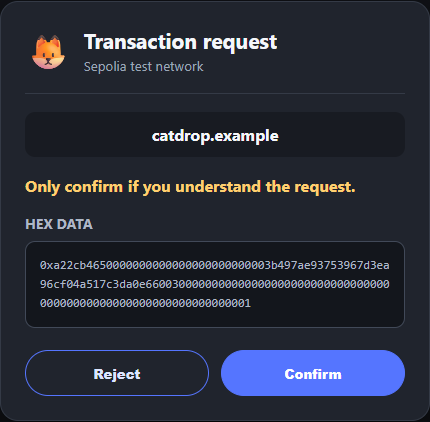

<!-- _class: title -->

Wallet security before approval

# PlainSign

Understand every Ethereum transaction and signature before you sign it.

---

## Wallet prompts expose data, not consequences

A button says **Free Mint**.

The wallet shows raw hex and asks for confirmation.

The hidden request grants permission to move an entire NFT collection.

---

## A plain-English checkpoint before the wallet

**Danger** appears before MetaMask.

The sentence names the real permission and the address receiving it.

Reject stops the request with standard wallet error `4001`.

---

## Live demo

● ● ● ● ● ● ●

Seven requests cover disguised approvals, Permit2, SIWE, WETH, opaque hashes, and Seaport.

The card explains the consequence before the real wallet receives the request.

---

## Technology

  dApp <small>EIP-1193</small><b>›</b>
  Provider proxy <small>MV3 MAIN world</small><b>›</b>
  Decode and enrich <small>viem + public data</small><b>›</b>
  Open rules <small>deterministic JSON</small><b>›</b>
  Overlay <small>React + Shadow DOM</small>

Continue forwards the untouched request. Reject returns error 4001. Optional Sepolia simulation adds expected balance changes.

---

## Innovation

**Signature-first** 
Permit2 and marketplace orders count as asset-risk events.

**Meaning-first** 
The lead sentence describes what changes for the user.

**Open rules** 
Every score and reason is auditable in `rules.json`.

---

## Impact and honest limits

<h3>Earlier decision</h3>
Users see the consequence before the wallet confirmation.

<h3>Clear reasons</h3>
Each verdict lists the rule that fired and what could go wrong.

<h3>Local by design</h3>
No backend, account, paid dependency, analytics, or telemetry.

PlainSign provides heuristics, not guarantees. Chrome and MetaMask are the primary path. EIP-6963 support is best-effort. Signatures are decoded rather than simulated. Unknown requests receive Caution.

---

## Roadmap

**Revoke dangerous permissions**

**Use community drainer lists with provenance**

**Expand to more EVM chains**

github.com/adib-cyber007/plainsign

